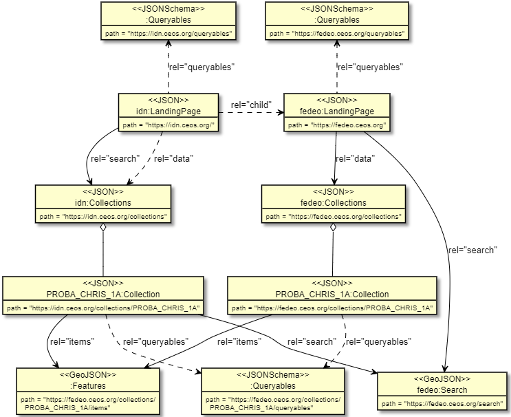

# Federated Search Extension Specification

- **Title:** Federated Search
- **Identifier:** <https://stac-extensions.github.io/template/v1.0.0/schema.json>
- **Field Name Prefix:** fed
- **Scope:** Collection
- **Extension [Maturity Classification](https://github.com/radiantearth/stac-spec/tree/master/extensions/README.md#extension-maturity):** Proposal
- **Dependencies** [STAC API - Collections](https://github.com/radiantearth/stac-api-spec/tree/master/collections)
- **Owner**: @littleidiot40 @ycespb

This document explains the Federated Search Extension to the [SpatioTemporal Asset Catalog](https://github.com/radiantearth/stac-spec) 
(STAC) specification.
This extension provides support fo the federated discovery use case. 
It uses the [OGC records](http://docs.ogc.org/DRAFTS/20-004.html#_query_parameters) specification to achieve this.

- Examples:
  - [Item example](examples/item.json): Shows the basic usage of the extension in a STAC Item
  - [Collection example](examples/collection.json): Shows the basic usage of the extension in a STAC Collection
- [JSON Schema](json-schema/schema.json)
- [Changelog](./CHANGELOG.md)

## Landing Page

The following Link relation must exist in the Landing Page (root).

| **rel**  | **href** | **type** | **From**               | **Description**             |
| -------- | --------- | ---------- | ------------ | --------------------------- |
| `search` | `/collections` | `application/json` | Extension | **REQUIRED** URI for the Collection Search endpoint |
| `data`   | `/collections` | `application/json` | OAFeat | **REQUIRED** URI for the list of collections |

This `search` link relation must have a `type` of `application/json`. It is assumed to represent a GET request.  The 
collection `search` link can be distinguished from a regular item `search` link as the `type` for the
item search should be `application/geo+json` instead.  The 
[OGC API-Features](https://docs.opengeospatial.org/is/17-069r3/17-069r3.html#_response) specification 
requires also a link to `/collections`
using the `data` relation, but this does not allow client applications to discover that 
search capabilities are available at the `/collections` endpoint, therefore both 
link relations are required.

> *NOTE:*  The above link is different from the rel=`search` link referring to `/search` 
> as defined in the STAC Item Search API.  Both its `type` and `href` are different.

In a federated search scenario, both a "federating" catalogue (e.g. IDN, CMR or FedEO) and individual data partner
"federated" catalogues are involved.  Each are expected to have their individual landing pages.  The `paths`
(href) to the individual resources of the STAC API are shown in the tables as relative paths.  They should be 
understood to be relative to the corresponding API landing page.  When we need to distinguish between a landing 
Page of a "federating" catalog and a data partner catalog, we use the notation \[federating\]/collections 
or \[federated\]/collections.

In a typical federated search scenario, the federating catalogue may have a local copy of all partner collections 
it federates.  They can be harvested by the federating catalogue from the data partners which make them available 
via the "rel=data" link in the data partner catalogue.  The federating catalogue makes available all the partner 
collections via a collection search endpoint via the "rel=search" link in the federating landing page.  There 
is no requirement for the data partners to have a collection search endpoint.  Providing the list of STAC 
collections via rel="data" with each of these collections having a rel="items" endpoint is sufficient.  This 
would be equivalent to the current CEOS practice in which partner collections including the URL of the items 
level search interface (OSDD) are provided in DIF10 format for publication by IDN.

The figure below depicts how a federating catalog (e.g. IDN) and federated catalog (e.g. FedEO) can share items search 
endpoints in 
a STAC context to  allow for a two-step search as currently supported by the CEOS Best Practices for OpenSearch.
In this example, a collection (ENVISAT MERIS Full Resolution) advertises its item search endpoint in the collections
advertised by the federating catalog (IDN).



## API Collection Search

### Endpoints

This extension also requires the endpoint below to be implemented as a [`local resources catalogue`](http://docs.ogc.org/DRAFTS/20-004.html#_tldr_local_resources_catalogue).

| Endpoint  | Returns         | Description     |
| --------- | --------------- | --------------- |
| `/collections` | List of Collections | Collection Search endpoint.  When invoked without any query parameters, no filter is applied. |

The response format is `application/json` and is an extension of the /collections response defined 
by [OGC API-Features](https://docs.opengeospatial.org/is/17-069r3/17-069r3.html) and
[STAC API-Collections](https://github.com/radiantearth/stac-api-spec/tree/master/collections). 
It may include pagination link as depicted in the figure below.


See [OGC API-Records §6.3](http://docs.ogc.org/DRAFTS/20-004.html#_tldr_local_resources_catalogue) where the endpoint `/collections` is 
provided as typical example of a `local resources catalogue`.  See also  §9 "Simple Query" of 
[OGC API - Common - Part 2: Geospatial Data](https://docs.ogc.org/DRAFTS/20-024.html#rc-simple-query-section) for 
additional information about the expected response content. 
 
### Query Parameters and Fields

The following list of parameters is used to narrow search queries. They can all be represented as query 
string parameters in a GET request (**REQUIRED**), or as JSON entity fields in a POST request. 

The core parameters for STAC collection search are borrowed from the [STAC Item Search](https://github.com/radiantearth/stac-api-spec/item-search).
This extension adds a few additional parameters for convenience.

| Parameter   | Type             | Source API | Description                                                                                                                                                                     |
| ----------- | ---------------- | ---------- | ------------------------------------------------------------------------------------------------------------------------------------------------------------------------------- |
| limit       | integer          | OAFeat     | **REQUIRED** The maximum number of results to return (page size).                                                                                       |
| bbox        | \[number]        | OAFeat     | **REQUIRED** Requested bounding box.                                                   |
| datetime    | string           | OAFeat     | **REQUIRED** Single date+time, or a range ('/' separator), formatted to [RFC 3339, section 5.6](https://tools.ietf.org/html/rfc3339#section-5.6). Use double dots `..` for open date ranges. |
| intersects  | GeoJSON Geometry | STAC       | Searches Collections by performing intersection between their geometry and provided GeoJSON geometry.  All GeoJSON geometry types must be supported.           |
| ids         | \[string]        | STAC       | **REQUIRED** Array of Collection ids to return.                                                                 |
| q           | \[string]        | OGC API-Records   | **REQUIRED** String value for textual search.   |     
| type        | \[string]        | OGC API-Records   | Resource type.      |
| externalId  | \[string]        | OGC API-Records   | External identifier associated with the collection. (same as `ids` ?)                     |

## STAC Collections

### Collection Properties

See [STAC Collection Specification](https://github.com/radiantearth/stac-spec/blob/master/collection-spec/collection-spec.md).

Note that [OGC API-Records §6.7](http://docs.ogc.org/DRAFTS/20-004.html#sc_record-collection-overview) defines a different list of possible
 fields for Collection in §6.7, e.g. `publisher` instead of `providers`.  We will have to propose the actual list 
 of mandatory elmements if mixing STAC and API-Records. 

### Collection Links

The following Link relations must exist in the Collection as [Link Object](https://github.com/radiantearth/stac-spec/tree/master/item-spec/item-spec.md#link-object).

| **rel**  | **href**  | **type** | **From**               | **Description**             |
| -------- | --------- | --------- | ------------- | --------------------------- |
| `items` | `/collections/{collection-id}/items` | `application/geo+json` | OAFeat | **REQUIRED** URI for the Item Search endpoint as per [§8.1.3 of OGC API-Records](http://docs.ogc.org/DRAFTS/20-004.html#_links). The current extension does not require that the `href` is relative to the landing page to allow for federated search as explained below. |

In a typical federated search scenario, the intention is to have a two-step search first identifying the appropriate collection(s) via 
the federating catalogue's collection search endpoint, followed by an item search in that collection.  For the federating catalogue to 
be able to use directly the item search endpoint provided by the federated catalog of the data partner, the constraint from OAFeat 
that the href of the link "rel=items" in a (STAC) collection should be relative to the local landing page and should correspond 
to `/collections/{collection-id}/items` needs to be relaxed.  We propose that the collections made available at the federating 
catalogue are allowed to have "rel=items" links referring directly to the federated catalog publishing the same collection, 
thus \[federated-1\]/collections/{collection-id}/items.  This allows that a federating catalog can delegate item search to the 
corresponding federated catalog and does not need to implement itself item search endpoints locally.

Alternatively, if a federated catalog does not only advertise rel="items" links in its collections, but advertises also a STAC search
endpoint (rel="search") in its landing page, the federating catalog can include this cross-collection search endpoint via a rel="search" link in the 
collection metadata obtained from the federated catalog.  With this approach, the OAFeat convention for the href of a rel="items" endpoint does not 
need to be relaxed and can be considered an approach defined by the current Extension.

### Collection Assets

| **role**  | **type**                           | **Description**             |
| -------- | ----------------------------------- | --------------------------- |
| `metadata` | `application/dif10+xml` | Collection metadata file in DIF-10 format. |

## API Item Search

The API for Item Search is derived from [STAC Item Search](https://github.com/radiantearth/stac-api-spec/item-search) and [OGC API-Features](https://docs.opengeospatial.org/is/17-069r3/17-069r3.html).
The current section defines the mandatory requirements.

### Endpoints

This conformance class also requires the endpoint below to be implemented.

| Endpoint  | Returns         | Description     |
| --------- | --------------- | --------------- |
| `/collections/{collection-id}/items` | Item Collection | Item Search endpoint.  |
 
### Query Parameters and Fields

The core parameters for STAC collection search are borrowed from the [STAC Item Search](https://github.com/radiantearth/stac-api-spec/item-search). 
This extension adds a few additional parameters for convenience.

| Parameter   | Type             | Source API | Description                                                                                                                                                                     |
| ----------- | ---------------- | ---------- | ------------------------------------------------------------------------------------------------------------------------------------------------------------------------------- |
| limit       | integer          | OAFeat     | **REQUIRED** The maximum number of results to return (page size).                                                                                        |
| bbox        | \[number]        | OAFeat     | **REQUIRED** Requested bounding box.                                                                                              |
| datetime    | string           | OAFeat     | **REQUIRED** Single date+time, or a range ('/' separator), formatted to [RFC 3339, section 5.6](https://tools.ietf.org/html/rfc3339#section-5.6). Use double dots `..` for open date ranges. |
| intersects  | GeoJSON Geometry | STAC       | Searches Collections by performing intersection between their geometry and provided GeoJSON geometry.  All GeoJSON geometry types must be supported.   TBD: this allowed on a STAC /search endpoint and not on an OAFeat /items endpoint ?   |
| ids         | \[string]        | STAC       | **REQUIRED** Array of item ids to return.     TBD: this allowed on a STAC /search endpoint and not on an OAFeat /items endpoint ?     | 
| externalId  | \[string]         | OGC API-Records       | External identifier associated with the item. (same as `ids` ?)  |

## STAC Items

### Item Properties 

Which item properties from which STAC extensions will CEOS recommend ?  A list of possibilities is shown in the [STAC/OGC17-003r2 Crosswalk](https://github.com/stac-utils/stac-crosswalks/tree/master/OGC_17-003r2).

[CEOS Best Practices](https://ceos.org/document_management/Working_Groups/WGISS/Documents/WGISS%20Best%20Practices/CEOS%20OpenSearch%20Best%20Practice.pdf) CEOS-BP-12,
CEOS-BP-12B, CEOS-BP-12C, CEOS-BP-12D and CEOS-BP-12E can be implemented using Link objects or Asset objects.  The following recommendations apply. 

### Item Links

In a catalog federation, the definition of 
the [relation types](https://github.com/radiantearth/stac-spec/blob/master/item-spec/item-spec.md#relation-types) 
should be interpreted with respect to the landing page and the structure of the catalog at the 
data provider (federated catalog).  Indeed, a data provider is not expected to modify metadata 
properties or links when he is being included in one or more federating catalogs.

| **type** | **Description** |
| -------- | --------------------------- |
| `root` | URL to the root STAC entity (Catalog or Collection) in the data provider (federated) catalogue, not at the federating catalog side. |
| `parent` | URL to the parent STAC entity (Catalog or Collection) in the data provider (federated) catalogue, not at the federating catalog side . |
| `collection` | STRONGLY RECOMMENDED. URL to a Collection in the data provider (federated) catalogue, not at the federating catalog side. |

> *NOTE:*  This may make it difficult to find the item search endpoint at the data provider side as it is presumably not visible inside
> the collection metadata itself but possibly via a local `/search` endpoint. 

### Item Assets

`CEOS-BP-012C`

| **role**  | **type**                           | **Description**             |
| -------- | ----------------------------------- | --------------------------- |
| `metadata` | `application/vnd.iso.19139+xml` | Granule metadata file in ISO 19139 format. |
| `metadata` | `application/gml+xml;profile=http://www.opengis.net/spec/EOMPOM/1.1` | Granule metadata file in OGC 10-157r4 format. |

`CEOS-BP-012D`

| **role**  | **type**                           | **Description**             |
| -------- | ----------------------------------- | --------------------------- |
| `metadata` | various | Granule metadata file in particular format indicated by media type. |
| `thumbnail` | various | Thumbnail image. |
| `overview` | various | Quicklook or browse image.  Image of the data typically used for making data request decisions |
| `data` | various | Data file or other science data resource; may be large in size. |

## Contributing

All contributions are subject to the
[STAC Specification Code of Conduct](https://github.com/radiantearth/stac-spec/blob/master/CODE_OF_CONDUCT.md).
For contributions, please follow the
[STAC specification contributing guide](https://github.com/radiantearth/stac-spec/blob/master/CONTRIBUTING.md) Instructions
for running tests are copied here for convenience.

### Running tests

The same checks that run as checks on PR's are part of the repository and can be run locally to verify that changes are valid. 
To run tests locally, you'll need `npm`, which is a standard part of any [node.js installation](https://nodejs.org/en/download/).

First you'll need to install everything with npm once. Just navigate to the root of this repository and on 
your command line run:
```bash
npm install
```

Then to check markdown formatting and test the examples against the JSON schema, you can run:
```bash
npm test
```

This will spit out the same texts that you see online, and you can then go and fix your markdown or examples.

If the tests reveal formatting problems with the examples, you can fix them with:
```bash
npm run format-examples
```
